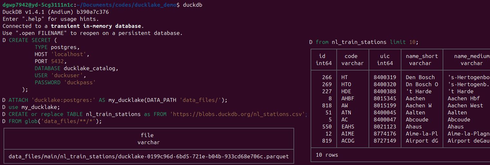
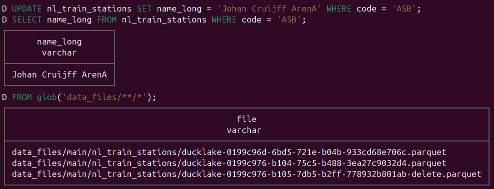
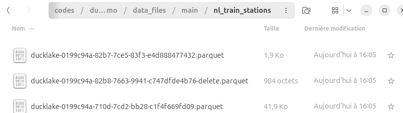
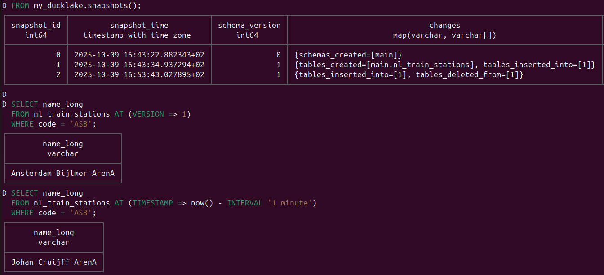

# P'tit répo démo DuckLake x PostgreSQL

## Commandes podman pour lancer notre BDD/Catalogue PostgreSQL

Podan est un équivalent docker cli

- Lancer `podman-compose up -d`
- Valider `podman ps`
- Fermer `podman-compose down` 

## Connecter DuckDB à notre DuckLake

- **doc :** [Introduction DuckLake](https://ducklake.select/docs/stable/duckdb/introduction)
- **script :** [ducklake_demo.sql](./ducklake_demo.sql)

### Etapes

1. Se connecter à la db catalogue gérée par PostgreSQL & ajouter une table à DuckLake
   
2. Réaliser un update & regarder l'impact (fichiers créés ...)
  \
  On voit qu'on a 1 petit nouveau fichier \
  & 1 fichier `xxx-delete.parquet` indiquant quelle ligne a été retirée dans le 1er parquet\
  
1. Explorer le time-travel
  
